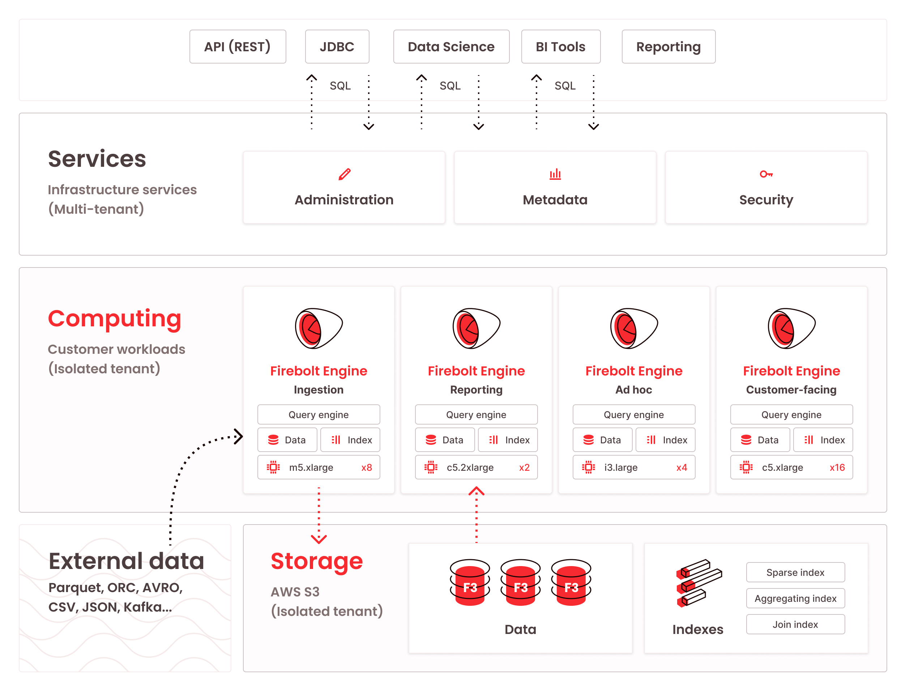

# 基于开源的商业模式

在开源软件占据软件供应链各个环节的背景下，任何商业模型的依赖路径上存在计算机软件的，基本都会部分依赖于开源软件。这就为基于开源的商业模式奠定了基础。

关注开源软件的订阅咨询的商业公司，包括著名的[红帽](https://www.redhat.com/en)、收购红帽的 [IBM](https://www.ibm.com/services/technology-support/open-source) 和收购了 Pivotal 的 [VMware Tanzu](https://tanzu.vmware.com/open-source) 实验室。

这三家公司都是 Kubernetes 的重要参与者，提供类似于 Kubernetes 发行版的云平台 PaaS 订阅服务。红帽还以提供 Linux 发行版和技术支持闻名，VMware 则有 Spring 这个 Java 生态的杀手级开发框架背书。在 IBM 的开源软件技术支持列表里，涵盖了从应用开发栈、数据平台、云平台到 DevSecOps 等领域的一系列知名开源软件。

开源软件的源代码是公开且免费可得的，任何用户都能够自由编译、演绎和使用在任何场景下。但是，经过几十年软件行业的发展，以及社会生活数字化的浪潮，现在广泛被使用的开源软件已经复杂到没有经过专门的训练和经验积累，很难应对形形色色的业务需求。21 世纪最难得的真的是人才，上面提到的这些企业通过建立起开源社群当中属于自己的品牌，以及提供良好的工作环境吸引到高水平的软件开发人员，从而能够提供这些广泛存在于其他商业公司软件供应链上的核心开源软件的支持和订阅服务。

例如，红帽工程师耗费两年的时间打造了 [Vert.x](https://vertx.io/) 反应式应用开发框架，并捐赠到 Eclipse 软件基金会共同创造出一个新的应用开发生态。厚积薄发，经过两年的设计开发和红帽客户资源增益的打磨，一个全新的开源软件和基于这个开源软件提供技术支持和订阅服务的商业模型正式成功上线。又例如，Pivotal 早在 2003 年就开始基于 PostgreSQL 开发 [Greenplum](https://greenplum.org/) 大规模并行处理系统，这个系统在经受 Impala 和 ClickHouse 等等后起之秀在十年之后的挑战之前一直代表相关领域的先进生产力。IBM 和 VMware 则是以收购见长，将这些已经成功走出订阅咨询路线的商业公司并入自己的企业服务版图，从而提供像上面 IBM 的开源技术支持那样全方位的服务。

阿里云、腾讯云和 AWS 等云厂商在其公有云平台上提供的开源软件托管服务，则是介于订阅和解决方案之间的商业模型。它们既有利用自己公有云平台和机器资源的优势，提供分毫未改的与开源软件相同的 API 的托管服务，例如 RDS 和 Redis 服务，也有发挥基础软件团队研发能力进行二次开发，产品能力升级或场景化定制的商业软件，例如 Ververica Platform 和 Tair 等等。

当然，售卖开源软件托管服务不是大型云厂商一家的专利。[Upstash](https://upstash.com/) 和 [Datastax](https://www.datastax.com/) 都捕捉到了关系型数据库以外，数据平台对 NoSQL 数据库在 KV 类型和消息系统类型的需求，分别基于 Redis + Apache Kafka 和 Apache Cassandra + Apache Pulsar 搭建了自己的托管服务。由于依赖的软件属于 Apache 软件基金会或其他第三方组织，即使这些企业接近于直接销售开源软件，但是也无法重新以专有协议许可，因此这些企业被迫会转向上面提到的订阅模型，或者这两家企业选择提供上述开源软件全球可用和高效治理的服务，以此来产生自己的附加值。

这种附加值可以认为是一个企业级的解决方案，选择了 Upstash 的 Redis 服务，就可以获得在欧洲、北美、南美和东南亚都符合当地合规要求的开箱即用的 Redis 接口。另一方面，可以认为是企业基于自己对企业软件生态的理解，提供的一套方法论。例如上一段提到这两家公司是组合了 KV + Messaging 的接口提供服务，认为这两者合作就能解决业务在边缘场景下的数据存储和上报消费的需求。

基于 [Trino](https://github.com/trinodb/trino) 分布式 SQL 查询引擎的公司 Starbrust Data, Inc. 全力推广 [Data Mesh](https://www.starburst.io/learn/data-fundamentals/what-is-data-mesh/) 的概念，基于 [Apache ShardingSphere](https://shardingsphere.apache.org/) 的公司 SphereEx 则全力推广 Database Plus 和 Database Mesh 的概念。这都是商业公司以开源软件为核心，打造出的一套有商业差异化的企业软件生态最佳实践或者叫方法论。只要你信了这套方法论，以同样的架构，同样的开源软件为核心搭建企业的软件生态，那么进一步产生付费，支持这一生态的顺利和高效运转，就是顺理成章的了。

彻底以产品化的解决方案来封装开源软件提供商业价值的模式，典型的企业包括 [Databricks](https://databricks.com/) 和 [Tetrate](https://www.tetrate.io/) 以及 [Firebolt](https://www.firebolt.io/) 等等。

说起 Databricks 这家公司，很容易想到的是他们的早期核心团队制造的 Apache Spark 开源软件。不过，Spark 早在核心团队还在大学实验室的时候就捐赠给了 Apache 软件基金会，因此同样改变软件协议来排他的销售软件是行不通的。Databricks 首先提供了具有明显性能优势的 Databricks Runtimes 产品，为对性能有极致追求的客户提供一个商业选择。然而，这样的用户毕竟是少的。于是 Databricks 开始了场景化的尝试，包括面向机器学习场景的 MLlib 和一系列的商业产品，包括面向一站式数据处理的 Delta Live Table 等组件，以及类似于上面提到的 Data Mesh 这样方法论的 LakeHouse 方法论与它的 [DeltaLake](https://delta.io/) 核心软件。

今天打开 Databricks 的官网，可以看到它早已在 Apache Spark 的基础上，长出了丰富的面向不同领域场景，面向不同用户案例和面向不同客户画像提供的一系列丰富的解决方案。构成这些解决方案的基础是 Apache Spark 丰富的生态，以及与开源的 DeltaLake 一脉相承的数据湖系统。在 Apache Spark 的名义下，在捐赠给 Linux Foundation 的 DeltaLake 的名义下，在 Databricks 官方 GitHub 组织的名义下，有着上百个连接数据平台开源共同体的开源软件。Databricks 在此之上又开发了面向不同场景不同解决方案需求的专有软件和商用代码，从而支撑起了自己的商业模型。

同样的，Tetrate 旨在提供云原生应用的网络治理方案。[Tetrate 重度参与](https://www.tetrate.io/open-source-contributions/)了 Istio 和 Envoy 以及 Apache SkyWalking 等开源项目的开发，雇员当中不乏相应社群的维护者乃至创始人。然而这家公司从未以相关开源社群所谓“背后的商业公司”自居，而是清晰地认识到自己的商业模式是依托于这些开源软件，提供自己定位在云原生应用的网络治理方案上所需的专有软件和企业级解决方案。Tetrate 有自己的 Istio 发行版，以在上游激进的发布模型之外为商业用户提供稳定、经过测试、高度兼容且 Tetrate 提供技术支持的 Istio 版本。此外，Tetrate 提供了 Tetrate Service Bridge 一揽子解决方案，在 Service Mesh 的方法论体系下支持客户将应用部署起来并完整监控和高效治理。

上面两个例子当中，Databricks 的工程师还有相当部分投入到 Apache Spark 和 DeltaLake 以及其他公司发布的开源软件的开发迭代，Tetrate 更是鼓励乃至促使重度参与提到的三个开源社群当中。Firebolt 的例子会有所不同，它很大程度上是作为 ClickHouse 的下游存在，极少参与上游开发。

Firebolt 仅将 ClickHouse 作为自己的计算执行引擎，在这一选型之外，完全专有化的实现了前台管控、集群管理和元数据管理、查询优化、数据索引和面向云存储的访问层。这样的商业模型也是依托于开源软件的，但是其依赖深度已经处于临界值。例如某些完全闭源的 Java 开发的专有软件，其中的网络模块也有可能使用开源软件 Netty 来实现，但是这种情形下，恐怕就不是我们这里所想讨论的企业实践开源的商业模式了。

Firebolt 这样的选型也算是自然的。如果你回顾 Databricks 的发展历程，它实际上可以被认为是选择了 Apache Spark 作为自己的计算执行引擎，逐渐发展出场景化的解决方案和 LakeHouse 一站式数据处理平台。不过，Databricks 的方向是逐渐走向开源。利用自己的先发优势，赚到行业内唯一提供商的收益以后，逐渐将自己的能力开源出来，以形成强凝聚力和活力的生态。这在下一节“开源标准以保护现有软件”会展开讨论。

反过来看 Firebolt 的做法，ClickHouse 在 fork 以后已经经历过闭源魔改，我相信时至今日它还是不是 ClickHouse 已经不好说了。Firebolt 也没有任何参与开源社群的征兆。因此我认为它会成为一个传统的商业软件公司，并在数据处理领域的开源浪潮下被吞噬。或许另一个世界当中的 Firebolt 走的是积极与上游协同的路线，共同发展 ClickHouse 的计算模块，并且在逐渐扩大自己商业版图的过程中把访问云存储的技术开源，查询优化和集群管理也开源，成为另一个行业标准的制定者。

回顾上一节当中我提到如果把源码公开的专有软件这一部分就明确认知成专有软件，上一节当中提到的商业公司也有形如 Databricks 和 Firebolt 这样不同的倾向性。虽然我相信开源运动持续下去，开源理念深入人心，因为高校研究突破也好，因为面向消费者的企业开源基础架构组件也好，因为下一节中要讨论的保护现有软件因此开源抢占标准也好，目前存在的所有专有软件，都会被开源软件所替代。

但是到那个时候，又会有新的商业需求产生，这些需求被开源运动的创造力满足的时间差，是存在提供解决方案的窗口的。世界之大，无奇不有，各种定制化的需求可以是非常特殊或小众的，而开源软件往往只解决主要问题和部分场景。另一方面，数字化进程大跨步前进，哪怕开源软件理论上能够解决好一个问题，但是实际实施的时候，仍然需要专家技术支持，并且维护后续迭代当中可能出现的问题。订阅咨询和解决方案这样依托于开源软件的商业模式，是能够长期存在的。
